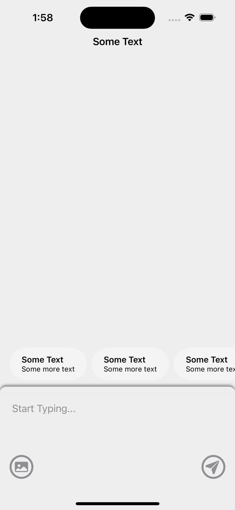

# InteractiveInputFieldDemo

A brief description of your iOS project. Explain the purpose and main features of the app.

## Prerequisites
Ensure you have the following installed:
- Xcode 16.2 or later
- iOS 18.2 SDK or later
- Swift 6.0 or later

## Getting Started
Clone the repository:
```bash
git clone https://github.com/chrisnyw/InteractiveInputFieldDemo.git
cd InteractiveInputFieldDemo
```

## Setup Instructions
1. Open the project in Xcode:
   ```bash
   open InteractiveInputField.xcodeproj
   ```

2. Select the target device or simulator in Xcode.


## Build and Run
1. Ensure the correct scheme is selected.
2. Click the **Run** button in Xcode or use the shortcut:
   ```
   Command + R
   ```
3. The app should launch in the simulator or connected device.

## Demonstratoin

### Video

<figure>

</figure>

### Screenshots

#### Idle State

Shows a text input field with placeholder "Start Typing..." with two buttons at the bottom.



#### Text Input Field Properties

1. When text field got focused


2. The initial font size set to 18px (maximum font size)


3. The font size reduces to 16px if the text occupies 2/3 of text input height


4. The font size reduces to 14px (minimum font size) if the text occupies 2/3 of text input height again


5. Text field is able to scroll when continuing add more texts


#### Fullscreen Text Input Field

When tapping of the expand button next to the input text field, will enter to fullscreen text editing mode


#### Photo Selection Properties

1. When pressing the photo icon on the bottom-left corner, the app shows the mini photo selection view


2. Scroll up the bottom mini photo selection view, the app will show all the photos stored in your iPhone


3. Clicked on one of the photo, the selected image will show between the input text field and the button like this:


## Happy coding!
